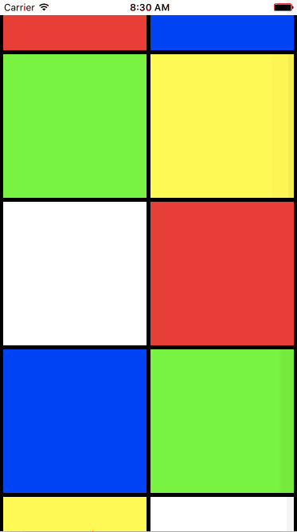
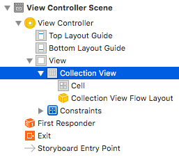
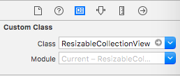

# ResizableCollectionView

ResizableCollectionView is a library to change the number of columns by pinch in / out.




## How To Get Started

### Installation with Carthage

`github "chidori-app/ResizableCollectionView"`

### Installation with CocoaPods

`pod 'ResizableCollectionView'`

### Manual Installation

1. Download source code.
2. Add ResizableCollectionView.swift to your project.


## Requirements

iOS 8.0 or higher.


## Usage

### Set up

1. Add "Collection View" element to StoryBoard.

  

2. Set the class of the element to `ResizableCollectionView` instead of CollectionView.

  

  * If you install from Carthage, set the module of the element to `ResizableCollectionView`.

3. Set ResizableCollectionView's dataSource.

4. Implement ResizableCollectionViewDataSource.
  (ResizableCollectionViewDataSource extends UICollectionViewDataSource of which implementation is required.)

  ```swift
  //MARK: - ResizableCollectionViewDataSource
  extension ViewController: ResizableCollectionViewDataSource {
      // optional
      func minNumberOfCellsInLine(collectionView: ResizableCollectionView) -> Int {
          return 2
      }
      // optional
      func maxNumberOfCellsInLine(collectionView: ResizableCollectionView) -> Int {
          return 6
      }
      // optional
      func marginOfCells(collectionView: ResizableCollectionView) -> CGFloat {
          return CGFloat(5)
      }
      // optional
      func thresholdOfZoom(collectionView: ResizableCollectionView) -> CGFloat {
          return CGFloat(0.6)
      }

      // MARK: - UICollectionViewDataSource
      func numberOfSectionsInCollectionView(collectionView: UICollectionView) -> Int {
          return 1
      }
      func collectionView(collectionView: UICollectionView, numberOfItemsInSection section: Int) -> Int {
          return 100
      }
      func collectionView(collectionView: UICollectionView, cellForItemAtIndexPath indexPath: NSIndexPath) -> UICollectionViewCell {
          return collectionView.dequeueReusableCellWithReuseIdentifier("Cell", forIndexPath: indexPath)
      }

  }
  ```

### Delegates

ResizableCollectionView has four delegate methods.

* `func willPinchIn(collectionView: ResizableCollectionView)`
* `func willPinchOut(collectionView: ResizableCollectionView)`
* `func didPinchIn(collectionView: ResizableCollectionView)`
* `func didPinchOut(collectionView: ResizableCollectionView)`


## Example

See the DEMO project `DEMO.xcodeproj`.


## Credits

ResizableCollectionView was created by [IOKA Masakazu](http://www.hitting.jp) in the development of [Chidori](http://nscallop.jp/chidori/)

ResizableCollectionView is used in [Chidori](http://nscallop.jp/chidori/), iOS application.


## Contact

Ask nscallop on Twitter ([@nscallop](https://twitter.com/nscallop))


## License

The MIT License (MIT)

Copyright (c) 2016 IOKA

Permission is hereby granted, free of charge, to any person obtaining a copy
of this software and associated documentation files (the "Software"), to deal
in the Software without restriction, including without limitation the rights
to use, copy, modify, merge, publish, distribute, sublicense, and/or sell
copies of the Software, and to permit persons to whom the Software is
furnished to do so, subject to the following conditions:

The above copyright notice and this permission notice shall be included in all
copies or substantial portions of the Software.

THE SOFTWARE IS PROVIDED "AS IS", WITHOUT WARRANTY OF ANY KIND, EXPRESS OR
IMPLIED, INCLUDING BUT NOT LIMITED TO THE WARRANTIES OF MERCHANTABILITY,
FITNESS FOR A PARTICULAR PURPOSE AND NONINFRINGEMENT. IN NO EVENT SHALL THE
AUTHORS OR COPYRIGHT HOLDERS BE LIABLE FOR ANY CLAIM, DAMAGES OR OTHER
LIABILITY, WHETHER IN AN ACTION OF CONTRACT, TORT OR OTHERWISE, ARISING FROM,
OUT OF OR IN CONNECTION WITH THE SOFTWARE OR THE USE OR OTHER DEALINGS IN THE
SOFTWARE.
